# Snapbook
Snapbook is an android application built with Kotlin and Java that combines the features of Instagram and OLX.
It works like Instagram with all basic features. It has a Selling and Buying hub where a user can buy products as well as sell them. Also the user can share that product on its news feed so that people can review it.

# Screenshots

<ul style="float:left">
    <table>
        <tr>
            <td>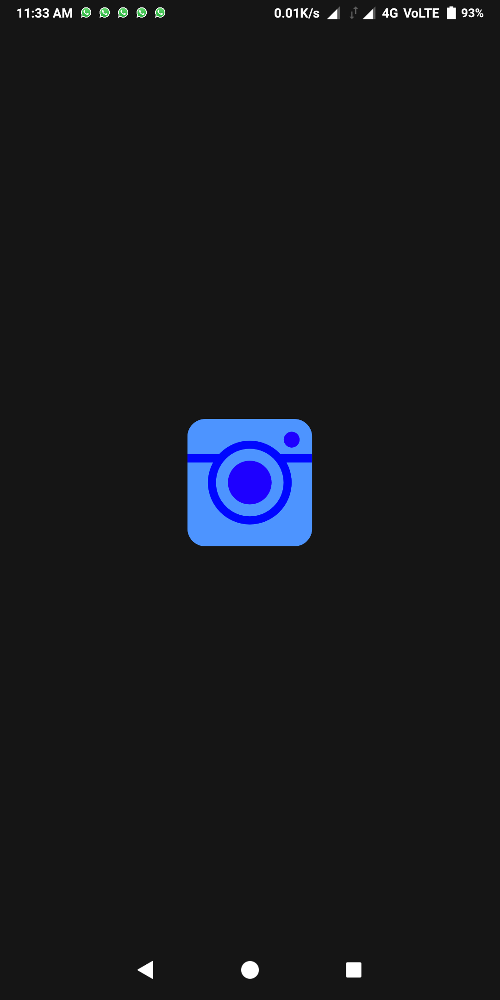</td>
            <td>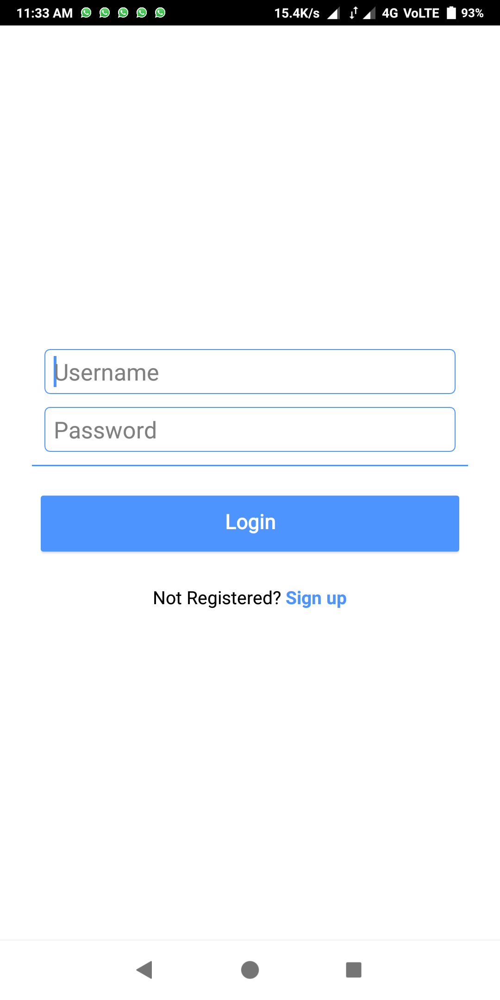</td>
            <td>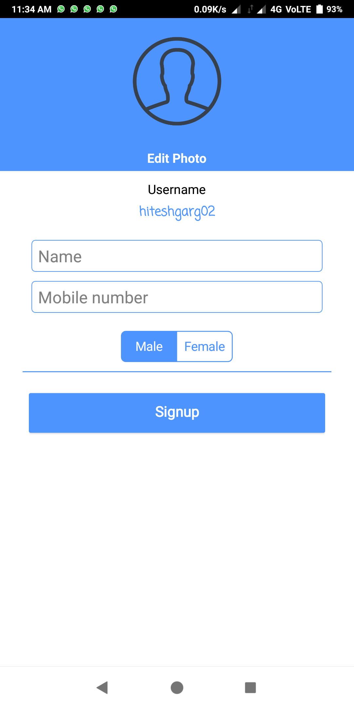</td>
        </tr>
        <tr>
            <td>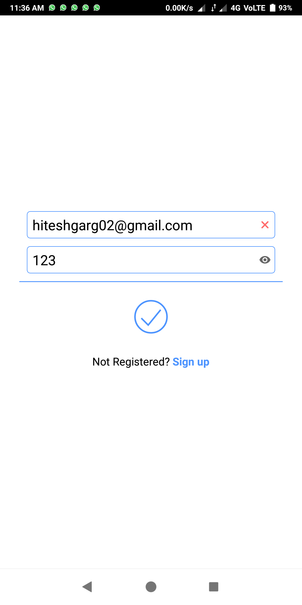</td>
            <td>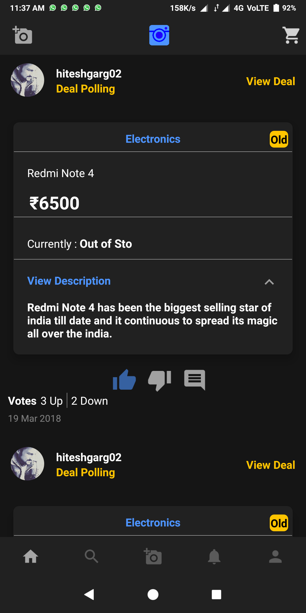</td>
            <td>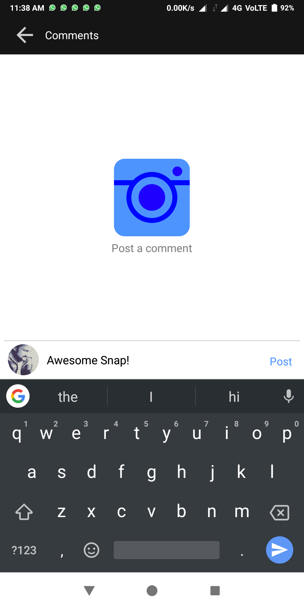</td>
        </tr>
        <tr>
            <td></td>
            <td>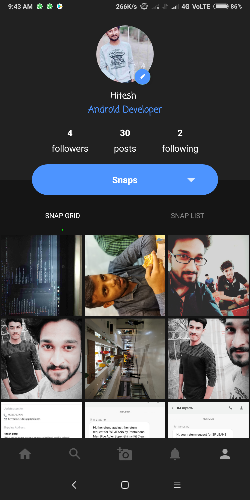</td>
            <td>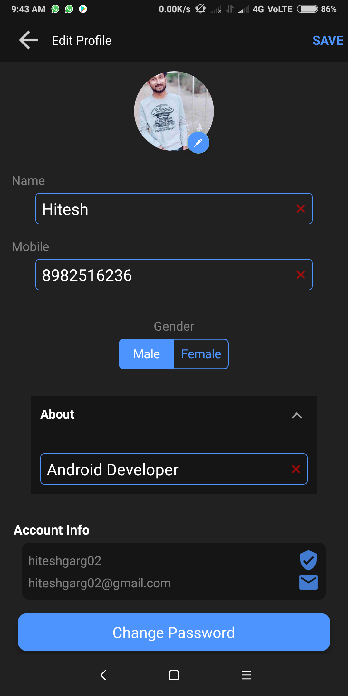</td>
        </tr>
        <tr>
            <td>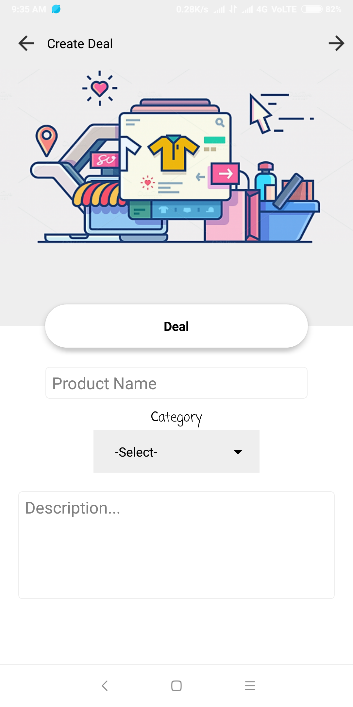</td>
            <td>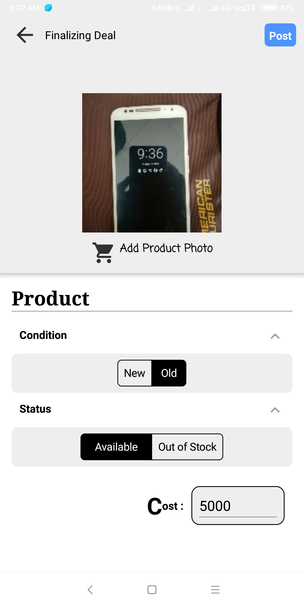</td>
            <td>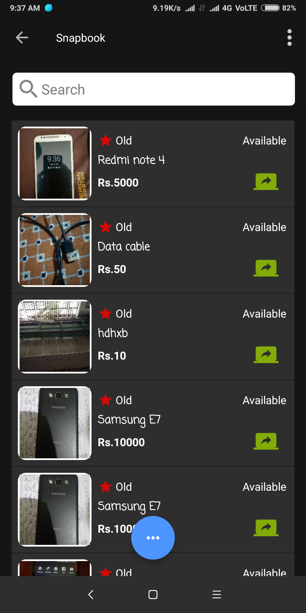</td>
        </tr>
        <tr>
            <td>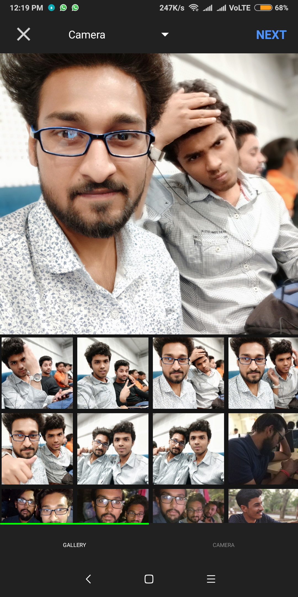</td>
            <td>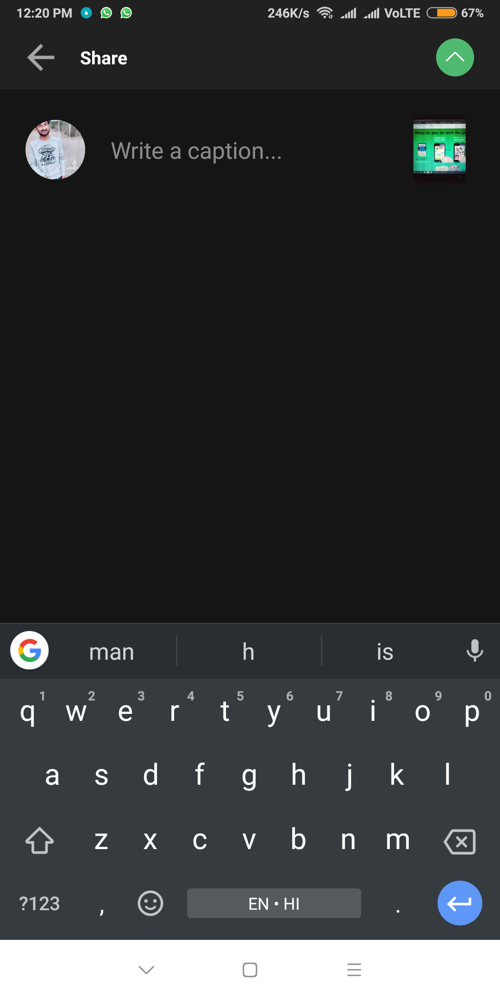</td>
            <td>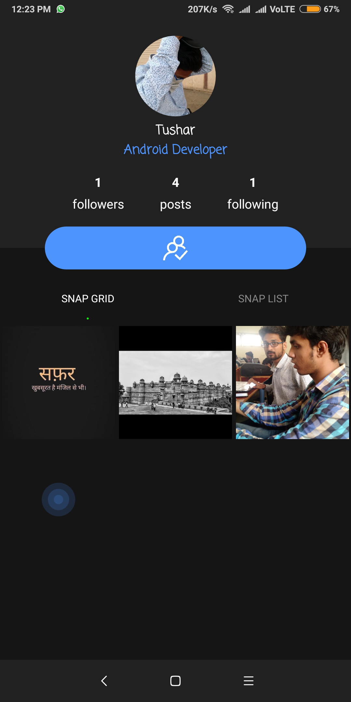</td>
        </tr>
        <tr>
            <td>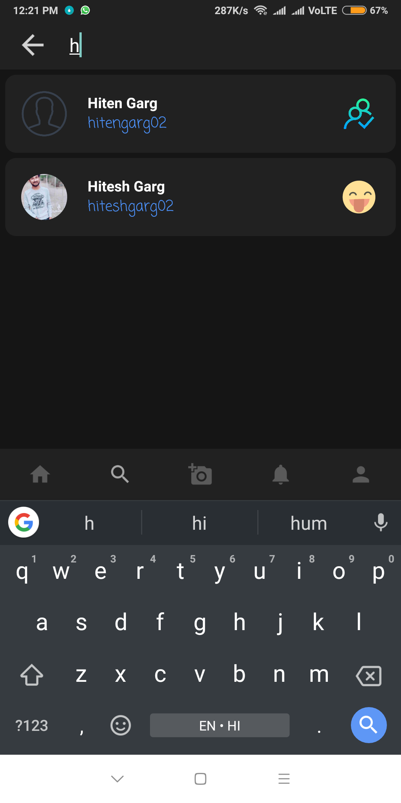</td>
            <td>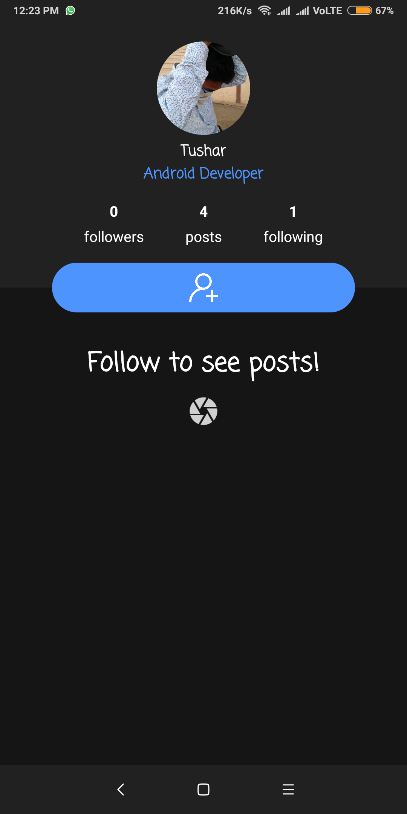</td>
            <td></td>
        </tr>
         <tr>
            <td></td>
            <td>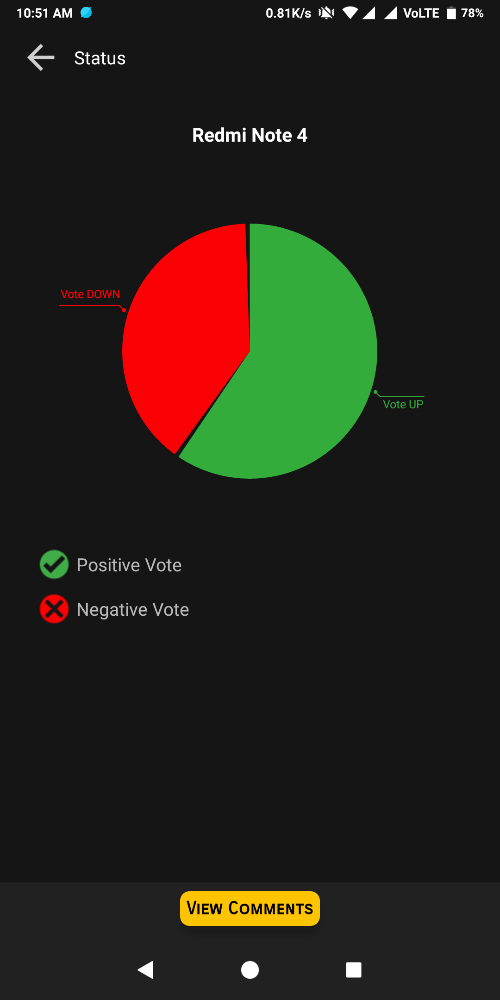</td>
            <td>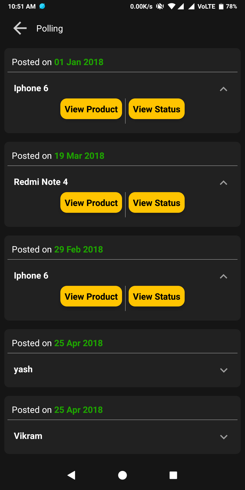</td>
        </tr>
    </table>
</ul>
